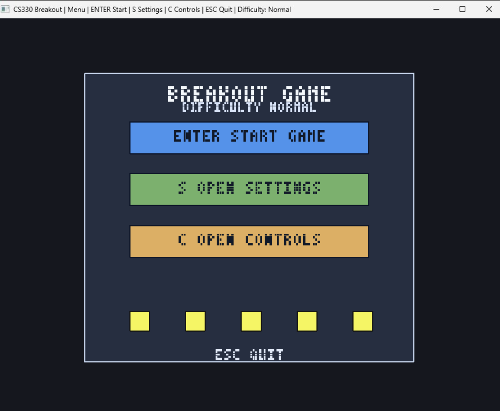
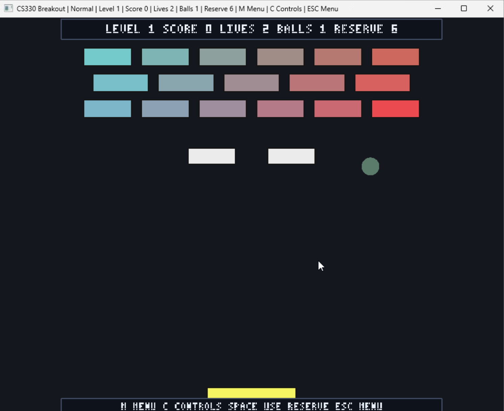

# CS330 Breakout (8-2 Assignment)

## Overview
This project is a 2D Breakout-style game for CS-330, built in C++ with GLFW and OpenGL (immediate mode).

## Screenshots
### Main Menu

### Gameplay

## Features
- Easy, Normal, and Hard difficulty modes
- Main menu, settings, controls, gameplay, and game-over screens
- Multi-hit destructible bricks with color feedback
- Ball-to-brick, ball-to-paddle, and ball-to-ball collisions
- Random ball-to-ball outcomes: merge, recolor, disappear, or split
- Power-ups: multi-ball, wide paddle, extra life
- Level progression with score and lives carryover
- Reserve-ball system (`SPACE` uses reserve balls, and you earn more by progress)
- Fixed 60 Hz simulation for stable gameplay behavior

## Build And Run (Windows / Visual Studio)
1. Open `Projects/8-2_Assignment/8-2_Assignment.sln` in Visual Studio 2022.
2. Select `Debug|Win32` or `Release|Win32`.
3. Build and run with `Ctrl+F5`.

## Controls
- `ENTER`: Start game / return from menus
- `S`: Open settings
- `C`: Open controls screen
- `M`: Open main menu
- `ESC`: Quit from main menu, otherwise return to menu
- `A` / `D` or `LEFT` / `RIGHT` (also `J` / `L`, numpad 4/6): move paddle
- `SPACE`: spawn one extra ball (uses one reserve ball)
- `R`: restart from game-over screen

## How To Play
1. Start from the main menu with `ENTER`.
2. Move the paddle and keep balls in play while breaking all destructible bricks.
3. Every ball that falls out of bounds costs a life.
4. `SPACE` can add an extra ball, but only if you have reserve balls.
5. You earn reserve balls by successful play (destroying enough bricks and clearing levels).
6. Collect power-ups to gain advantages (multi-ball, wide paddle, extra life).
7. Reach game over when lives hit zero.

## Documentation
- Developer/architecture notes: [`Projects/8-2_Assignment/DEV.md`](Projects/8-2_Assignment/DEV.md)
